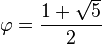

math
====
_Attempt at making bignumber.js feel a little better_

This is a simple wrapper around [bignumber.js](https://github.com/MikeMcl/bignumber.js/) to make it easier to reason about your operations.

## Difference with bignumber.js
In bignumber.js you would calculate something like the golden ratio like this
```js
var BigNumber = require("bignumber.js");
var goldenRatio = BigNumber(5).sqrt().plus(1).div(2);
```

I don't really like this notation. I feel like we don't reason about math the same way we do about data in a computer. When we write a formula like 

 

we don't necessarily have in mind the fact that the square root is going to have to be computed first, then the addition and finally the division.

I think math is already hard enough by itself and it doesn't need an extra complexity of mentally figuring out the order in which the operations should be conducted.

Here's how you would do the same operations with math.
```js
var math = require("math");
var goldenRatio = math.solve([
    [1, math.plus, [math.sqrt, 5]], // 1 + sqrt(5)
    math.div,                       // -----------
    2                               //      2
]);
```

This is arguably nicer. 

Maybe not as nice as
```js
var x = (1 + Math.sqrt(5)) / 2
```

But bignumber.js supports numbers that have up to 2^32 - 1 digits, which I would consider enough precision for most cases.